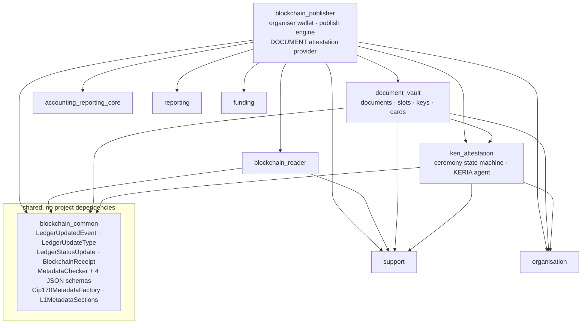
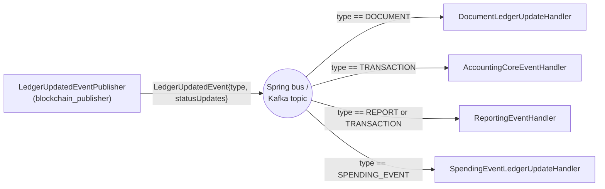
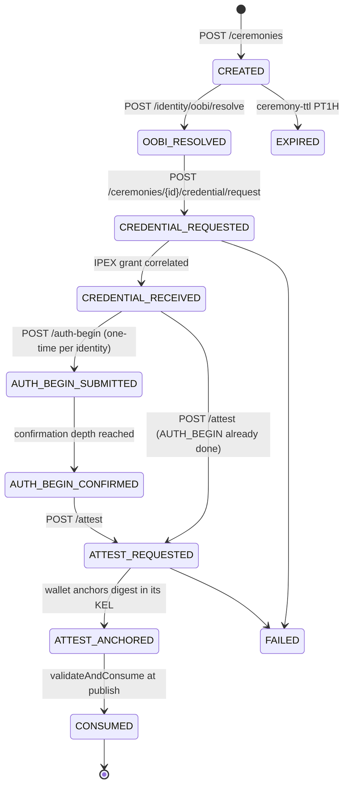
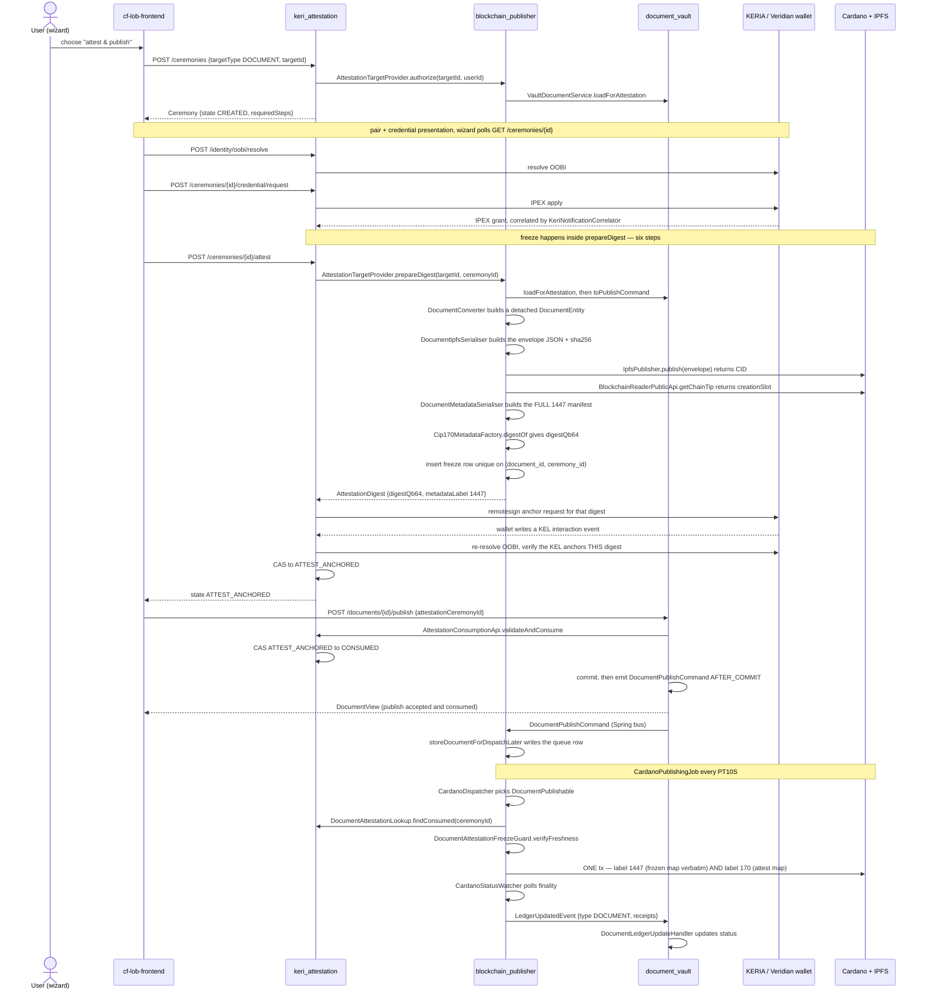
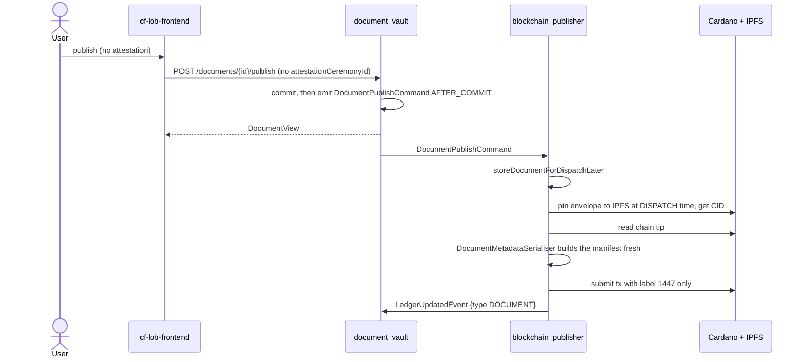
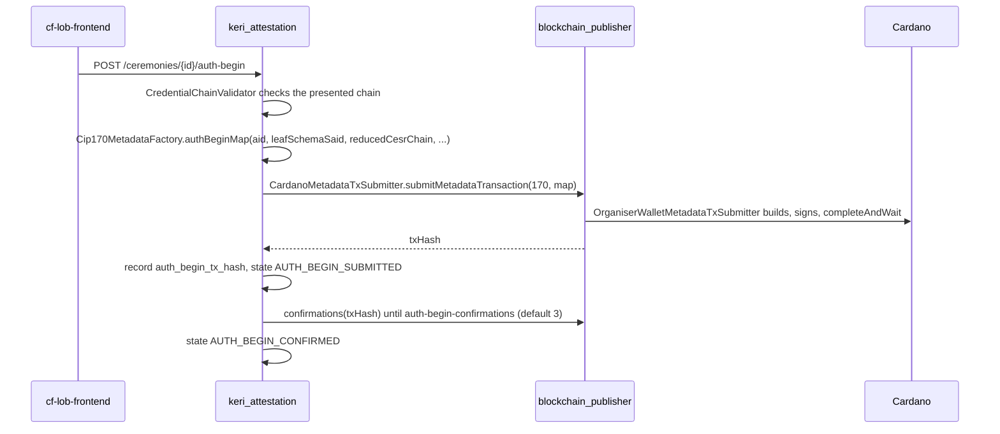
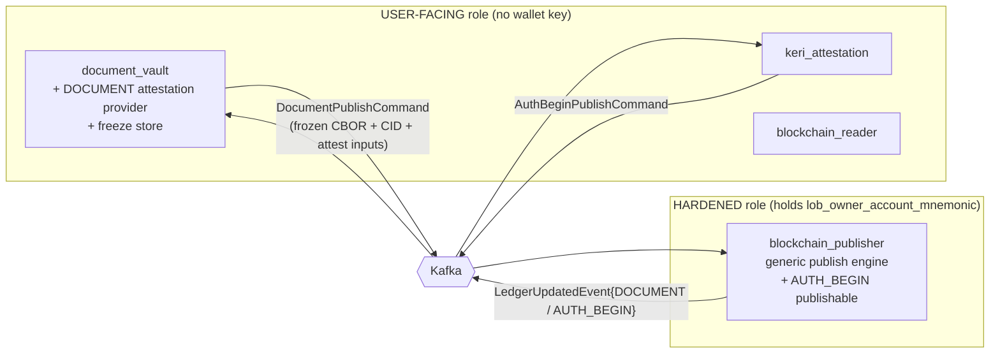

# Document KERI attestation & publishing — detailed flow

**Status:** describes the code as it stands on `feat/document-module` (after the shared-metadata-section consolidation). Anything not yet built is confined to §9 and marked **PLANNED** — everything in §1–§8 is what runs today.

---

## 1. Module map

Arrows are Gradle `implementation` dependencies, i.e. compile-time direction. Only the modules involved in this flow are shown.

Two edges matter for the architecture:

- **`document_vault → keri_attestation`** — the vault calls `AttestationConsumptionApi` to exchange a completed ceremony for its attestation. Wired at runtime through `ObjectProvider`, so the vault works fully with `keri_attestation` disabled.
- **`blockchain_publisher → document_vault` and `→ keri_attestation`** — the publisher hosts the DOCUMENT `AttestationTargetProvider` and calls `VaultDocumentService` directly. **This is the edge that must be removed** to get the publisher into a hardened, key-holding-only tier. It is why the document and KERI code is currently deployed *into* the wallet-holding process.

---

## 2. Event inventory (what exists today)

`@DomainEvent`-annotated records on the in-process Spring bus. The "Kafka topic" column is what `cf-reeve-application` externalises — note both document and KERI events are **not** bridged yet.

| Event | Declared in | Emitted by | Consumed by | Kafka topic |
|---|---|---|---|---|
| `DocumentPublishCommand` | `document_vault.domain.events` | `VaultDocumentService.publish`, `DocumentDispatchRetryJob` | `BlockchainPublisherEventHandler` | **none yet** |
| `DocumentPublishedEvent` | `document_vault.domain.events` | `document_vault` | in-module | none |
| `DocumentSharedEvent` | `document_vault.domain.events` | `document_vault` | in-module | none |
| `LedgerUpdatedEvent` | `blockchain_common.domain` | `LedgerUpdatedEventPublisher` (publisher) | `DocumentLedgerUpdateHandler`, `AccountingCoreEventHandler`, `ReportingEventHandler`, `SpendingEventLedgerUpdateHandler` | `blockchain_common.domain.LedgerUpdateEvent` |
| `TransactionLedgerUpdateCommand` | `accounting_reporting_core` | accounting core | publisher | yes |
| `PublishReportEvent` | `reporting.dto.events` | reporting | publisher | yes |
| `SpendingEventsPublishCommand` | `funding.domain.events` | funding | publisher | yes |
| `RelinkCompletedEvent` | `keri_attestation.service` | `KeriOobiService` | `RelinkInvalidationSweepHandler` | none |

`LedgerUpdatedEvent` is the single fan-out channel back from the publisher. Every consumer guards on the discriminator and returns early:

`LedgerUpdateType` has exactly four constants: `TRANSACTION`, `REPORT`, `SPENDING_EVENT`, `DOCUMENT`. Each `LedgerStatusUpdate` carries `{id, ledgerDispatchStatus, errorReason, blockchainReceipts}`.

---

## 3. The cross-module ports

These are synchronous Java interfaces, not events. They are the seams a service split has to convert.

| Port | Declared in | Implemented in | Purpose |
|---|---|---|---|
| `AttestationTargetProvider` | `keri_attestation.service` | `blockchain_publisher` (`DocumentAttestationTargetProvider`) | `targetType()`, `authorize()`, `prepareDigest()` — one impl per attestable type, collected by `AttestationTargetProviderRegistry` |
| `AttestationConsumptionApi` | `keri_attestation.service` | `keri_attestation` (`CeremonyService`) | `validateAndConsume`, `findConsumed`, `findTerminalNonConsumedCeremonyIds` |
| `CardanoMetadataTxSubmitter` | `keri_attestation.service` | `blockchain_publisher` (`OrganiserWalletMetadataTxSubmitter`) | `submitMetadataTransaction`, `confirmations`, `readCip170Metadata` |
| `AttestationFreezeGuard` | `keri_attestation` | `blockchain_publisher` (`DocumentAttestationFreezeGuard`) | freeze freshness + envelope-hash recheck at publish |
| `OrganisationPublicApiIF` | `organisation` | `organisation` | org lookup for the manifest `org` section |

---

## 4. Ceremony state machine (`keri_attestation`)

Row-locked `(state, attemptGeneration)` compare-and-set on `keri_attestation_ceremony`. `requiredSteps` lets a returning identity skip completed one-time steps.

`WAITING_STATES` — the three the frontend polls fast — are `CREDENTIAL_REQUESTED`, `AUTH_BEGIN_SUBMITTED`, `ATTEST_REQUESTED`.

**`ATTEST_ANCHORED` is a KERI event, not a Cardano one.** No transaction is submitted at that point.

---

## 5. Attested document publish — end to end

The critical subtlety: **the ATTEST label-170 metadata rides inside the document's own label-1447 publish transaction.** There is no separate ATTEST transaction.

On the attested path the publisher **never re-pins IPFS and never re-serialises the manifest** — it reuses the frozen CID and frozen 1447 CBOR verbatim, fetching only a fresh chain tip for the transaction validity interval. That is required: the wallet's signature commits to those exact bytes.

The frozen 1447 map includes `data.recipient_key_hashes`, read from immutable `document_vault_document_slot` columns written at upload. That is precisely why the hashes are stored rather than derived at publish: re-deriving them from key rows on a retry sweep could change the frozen bytes and invalidate the wallet's signature, and a dangling `keyId` is an expected, tolerated state.

---

## 6. Plain publish (no attestation) — the default

The two paths differ only in: who builds the manifest and when, when IPFS is pinned, whether a freeze row exists, and whether label 170 is present.

---

## 7. AUTH_BEGIN — the one standalone CIP-170 transaction

Published once per identity, not per document. This is the **only** place the ceremony waits on a Cardano confirmation.

---

## 8. Scheduled jobs

All plain `@Scheduled` — there is no ShedLock, leader election or advisory locking anywhere, so every job fires on **every** pod.

| Job | Module | Cadence | Concurrency safety today |
|---|---|---|---|
| `CardanoPublishingJob` | blockchain_publisher | `PT10S` | `supportsLocking()` window per publishable type |
| `CardanoWatchDogJob` | blockchain_publisher | configurable | status re-read, idempotent |
| `DocumentAttestationFreezeCleanupJob` | blockchain_publisher | `PT30M` | deletes only terminal-non-consumed freeze rows |
| `CeremonyCleanupJob` | keri_attestation | `PT10M` | purges FAILED/EXPIRED, never CONSUMED |
| `DocumentRetentionJob` | document_vault | daily 03:00 | — |
| `DocumentDispatchRetryJob` | document_vault | configurable | `dispatchRetryAt` cursor, NULLS FIRST |

Idempotency rests on `storeOnlyNew(...)` gateways, unique constraints caught as `DataIntegrityViolationException` ("lost the race, re-read the winner"), and `PESSIMISTIC_WRITE` row locks on documents, ceremonies and identity links.

---

## 9. PLANNED — target state (not built)

Nothing below exists yet. See `docs/superpowers/specs/2026-07-24-decentralized-document-keri-attestation-design.md`.

The changes, in required order:

1. **Kafka unknown-enum tolerance + consumer error/DLT handling** — must land *before* any new `LedgerUpdateType` constant is emitted. Today an unknown enum fails during poll, before the equality guards run, on the topic transactions share, with no recovery path.
2. Move `DocumentPublishCommand` and the attestation contract types into `blockchain_common`.
3. `AuthBeginPublishCommand` + `LedgerUpdateType.AUTH_BEGIN` + `AuthBeginEntity`/`AuthBeginPublishable`/`AuthBeginL1TransactionCreator`, retiring `OrganiserWalletMetadataTxSubmitter` and the `CardanoMetadataTxSubmitter` port. **ATTEST needs no publishable** — it already rides in the 1447 tx.
4. Relocate the DOCUMENT attestation provider into `document_vault`, delete `DocumentAttestationLookup`, and carry the resolved attestation in the publish command. Freeze computes the CID locally and the publisher pins at publish, failing closed on mismatch.
5. Bridge classes + `topics`/`consumer-group` config for `document_vault` and `keri_attestation`.
6. Leader-locking for every `@Scheduled` job, a pod-agnostic KERIA notification bridge, and `organisation_id` on the ceremony table.
7. Move `LOB_DOCUMENT_VAULT_ENABLED` / `LOB_KERI_ATTESTATION_ENABLED` to the `api` service and strip `lob_owner_account_mnemonic` from every non-publisher service.

### Two known defects in the current wiring

- **`FundingConsumer` and `AccountingCoreKafkaConsumer` share a `groupId`** (`lob-consumer-accounting-core`) on the same `ledger-update-command` topic, so they split partitions rather than each receiving every record. It works only because whichever one receives it republishes onto the shared local Spring bus. Split those modules across pods and messages go missing.
- **Abandoned ceremonies leak pinned IPFS content.** `prepareDigest` pins immediately, `IpfsPublisher` has no unpin operation, and the cleanup job only deletes rows. Deferring the pin to publish time removes this by construction.
