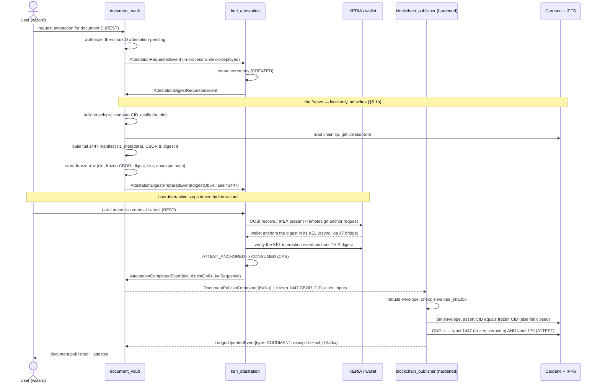

# Decentralized KERI Attestation — Design (DOCUMENT first)

**Status:** Draft for review (v2 — rebaselined 2026-07-27 against the real `cf-reeve-application` deployment model)
**Scope:** **DOCUMENT only**, backend (`cf-reeve-platform` + `cf-reeve-application`) and frontend (`cf-lob-frontend`, worktree `feat+document-module`, §6.2 — near-zero change by design). Plain publish without attestation stays a first-class path (§6.1). No second target type is built here. The flow is *designed* target-generic and the reuse seams are put in place now (§4.1), because they are cheap while DOCUMENT is the sole implementation and awkward afterwards — but REPORT and the rest are explicitly out of scope (§4.2).

> **v2 note.** v1 was written against an incorrect baseline ("one Spring Modulith app; no Kafka anywhere — greenfield") and therefore proposed a parallel architecture: three independently-deployable services with their own databases, a new `lob-attestation-contracts` library, a schema registry, Avro/JSON-Schema payloads, and a rebuilt "generic gateway" in place of the publisher.
>
> None of that is needed. Reeve already ships **one artifact deployed N times behind env flags**, already has **a working Spring-event↔Kafka bridge** in `cf-reeve-application`, and the publisher **already contains a generic, pluggable publishing engine** whose own contract says adding a new publishable type does not change the engine. So this version does the opposite of v1: it extends what exists rather than paralleling it. Concretely, the one standalone CIP-170 transaction (AUTH_BEGIN) becomes a fifth `CardanoPublishable` fed by a standard `*PublishCommand` event, ATTEST needs no new publishable at all because it already rides in the document's own publish tx, and no code is copied between modules — the only relocations are one package move of a shared record and one domain class returning to the module that owns its data.
>
> v2 also treats the flow as a **reusable capability rather than a document feature** (§4.1). `keri_attestation` is already target-agnostic, and reports, transactions and spending events are meant to attest the same way, so the design preserves that property instead of quietly re-coupling it to `document_vault`. It does **not** build a second target type — §4.2 draws that line.
>
> v1's genuinely correct calls are kept: extract the duplicated CIP-1447 serialiser, keep domain knowledge out of the hardened tier, and stop the ceremony assuming one pod. §3 is the corrected baseline; §13 lists what changed and why.

## 1. Goal

Let the document KERI-attestation flow run in the **split topology** Reeve already deploys:

- **`blockchain_publisher` runs in a hardened environment** because it is the only component that holds `lob_owner_account_mnemonic`. Nothing else may.
- **`document_vault` + `keri_attestation` run in the user-facing environment**, where the wizard, uploads and REST API live.
- The two tiers communicate **only by events over Kafka**, never by direct calls or shared transactions.
- The **same codebase still runs as a monolith** (one JVM, `SPRING_KAFKA_ENABLED=false`, in-process Spring events).
- **Every role can run as multiple pods.**

Today none of this holds for the document flow: `blockchain_publisher` compile-depends on `document_vault` and `keri_attestation` and calls straight into `VaultDocumentService`, so the document/KERI code is deployed *into the key-holding tier* — the opposite of the target.

Closing that gap is smaller than it looks. Most of the publisher's `document_vault` coupling is a **record in the wrong package**, not logic in the wrong module, and the one remaining synchronous call into the hardened tier (`CardanoMetadataTxSubmitter`) is replaced by the same command-event-plus-publishable pattern the other four publish types already use. The publish engine, the queue, the status watcher and the confirmation channel are all reused as-is.

## 2. Decisions

| # | Decision | Rationale |
|---|---|---|
| D1 | **The hard boundary is key custody, not decentralization.** The only invariant that must never bend: `lob_owner_account_mnemonic` exists solely in the `blockchain_publisher` deployment. | This, not reusability, is why the publisher is separate. It sets the priority order for every step below. |
| D2 | **One build artifact, several deployment roles** — not three services. Roles are `LOB_*_ENABLED` flag sets over the same image, exactly as `api` and `publisher` work today. | Matches the shipped model (`docker-compose.yml` runs one image twice; `docker-compose.lightweight.yml` runs it once with everything on). Preserves monolith mode for free. |
| D3 | **`document_vault` + `keri_attestation` co-deploy as one user-facing role.** Their compile dependency (`document_vault → keri_attestation`) may stay. | Assumed for this draft — see §12 Q1. They are still expressed as domain events so a later split is a config change, not a rewrite. |
| D4 | **Shared DB is allowed but never relied on.** Invariant: no module reads another module's tables, no cross-module transaction, and **no cross-module lock-ordering assumption**. | The user constraint is "could be one DB, could be several." Only the invariant makes both work — see the `DocumentAttestationLookup` violation in §3. |
| D5 | **Reuse the existing Kafka bridge convention.** New cross-tier traffic is Spring domain events externalized by bridge classes in `cf-application/.../kafka/`, JSON-serialised, topic-per-event-class. No new contracts library, no schema registry, no Avro. | A second messaging convention in the same system is a liability. The contract is already the shared Java record, versioned by the platform artifact. |
| D6 | **Multi-pod = plain replicas, one consumer group per role, row-level `organisation_id` scoping.** No per-tenant topics or pods. | Assumed for this draft — see §12 Q2. Matches how orgs are separated today (per-customer *deployments*, `organisation_id` columns, zero "tenant" concept in code). |
| D7 | **Owning modules own their metadata, but reuse one shared serialiser.** The CIP-1447 manifest serialisation is extracted into a shared platform module; not duplicated per module, not left document-specific in the publisher. | Carried over from v1 D4. `DocumentMetadataSerialiser` currently copies the `metadata`/`org` sections verbatim from the report serialiser. |
| D8 | **Extend the publisher's existing publishable engine — do not build a second one.** The one standalone CIP-170 transaction, AUTH_BEGIN, becomes a **fifth `CardanoPublishable`** driven by a standard `*PublishCommand` event. ATTEST gets nothing new: it is already a second metadata label on the target's own publish transaction (§5.2). | `CardanoPublishable`'s own javadoc states the contract: *"Adding a fourth type therefore means implementing this interface (plus an entity + migration); the engine itself never changes."* The queue, dispatcher, locking window, status watcher, rollback and confirmation fan-out all come for free. |
| D9 | **Shared command/event types live in `blockchain_common`.** `DocumentPublishCommand` moves there alongside `LedgerUpdatedEvent`; the new attestation command and the attestation lifecycle events are defined there from the start. | `blockchain_common` has no project dependencies and is already depended on by `document_vault`, `keri_attestation` and `blockchain_publisher`. `LedgerUpdatedEvent`'s javadoc set the precedent: it lives there *"so the publisher and all consumers can share it without cross-module (circular) dependencies."* |
| D10 | **Nothing is copied between modules.** The only code that relocates is the DOCUMENT attestation provider — deleted from the publisher, implemented where its data lives. Everything else is a package move of a shared record, or new code in one place. | Duplicated serialisers are already the defect D7 exists to fix; the migration must not create more. |
| D15 | **The freeze computes the CID; the publisher pins it.** IPFS stays entirely in `blockchain_publisher`, as it is for every other publishable. Freezing is a pure local computation plus one keyless chain-tip read; the pin happens at publish, guarded by `envelope_sha256` and a fail-closed CID comparison. | Keeps IPFS in one place that other modules need not think about, and stops abandoned ceremonies leaking permanently pinned ciphertext — `IpfsPublisher` has no unpin operation and the cleanup job only deletes rows. Cost: local CID computation must match the backend, so it needs a per-backend conformance test (§5.1b). |
| D11 | **Confirmation reuses `LedgerUpdatedEvent`.** A new `LedgerUpdateType` lets the AUTH_BEGIN tx report back on the channel every other publishable already uses; the attested document publish already reports as `DOCUMENT`. Only `readCip170Metadata` (external-authority verification) needs a separate chain read, from `blockchain_reader`. | Subsumes `CardanoMetadataTxSubmitter.confirmations()` into the existing `CardanoStatusWatcher` rather than inventing a reply topic. |

## 3. Current state (corrected baseline)

**Build & assembly.** `cf-reeve-platform` is a *library*: 13 Gradle modules published to Maven as `cf-lob-platform-<module>` (pinned at `1.7.0`). `cf-reeve-application` is a thin assembler — `cf-application` depends on those artifacts and produces **one Spring Boot fat jar and one Docker image**. `LobServiceApp` declares `@EnableJpaRepositories({"org.cardanofoundation.lob"})` + `@EntityScan("org.cardanofoundation.lob")`, so every module shares one `EntityManagerFactory` and one datasource.

> `document_vault` and `blockchain_reader` are **not declared** in `cf-application/build.gradle.kts`; they arrive transitively through `blockchain_publisher`. Disabling the publisher in a deployment role does not remove them from the classpath today, but the packaging is accidental and must be made explicit (§10 step 0).

**Deployment.** Same image, different `LOB_*_ENABLED` env flags:

| Role | Flags | Key material |
|---|---|---|
| `api` (user-facing, :9000) | accounting core, organisation, reporting, funding **on**; publisher/reader/netsuite **off** | — but `lob_owner_account_mnemonic` **is still injected** (see below) |
| `publisher` (:9001) | publisher, reader, netsuite, csv **on**; accounting core, organisation, reporting **off**; `LOB_DOCUMENT_VAULT_ENABLED` / `LOB_KERI_ATTESTATION_ENABLED` configurable **here** | `lob_owner_account_mnemonic` (`CardanoClientLibConfig.ownerAccount`) |
| `follower-app` | genuinely separate image + own schema `lob_follower_service` | — |
| `lightweight` | everything on in one JVM, `SPRING_KAFKA_ENABLED=false` | monolith mode |

Two facts here are the whole problem: the document/KERI modules are wired into the **publisher** role, and `docker-compose.yml` passes `lob_owner_account_mnemonic` into the **api** container as well, even though `LOB_BLOCKCHAIN_PUBLISHER_ENABLED: false` there.

**Kafka is already live**, not greenfield. `cf-application` depends on `spring-kafka`; `application.yml` configures an idempotent producer, `enable-auto-commit: false` (though no listener takes an `Acknowledgment`, so acking is container-default, not manual — §14), KIP-848 cooperative rebalancing, and **15 MB** `max.request.size` / `fetch.max.bytes`; compose runs Kafka 4.1.1 (KRaft) with a `kafka-ssl` profile. A build-time `KAFKA_ENABLED=false` excludes `**/kafka/**` from compilation entirely.

**The bridge pattern** (`cf-application/src/main/java/org/cardanofoundation/lob/app/kafka/{publisher,consumer}`, 5 pairs today) is the mechanism that makes one codebase run either topology. Platform modules contain **zero** Kafka code — they only publish Spring events:

```java
// publisher side — gated on the PRODUCING module's flag
@ConditionalOnProperty(value = {"lob.blockchain_publisher.enabled", "spring.kafka.enabled"}, havingValue = "true")
@EventListener
public void handleTxLedgerUpdatedEvent(LedgerUpdatedEvent event) {
    kafkaTemplate.send(ledgerUpdatedEventTopic, event);
}

// consumer side — gated on the CONSUMING module's flag; re-injects into the local bus
@KafkaListener(topics = "${...}", groupId = "${lob.blockchain_publisher.consumer-group}")
public void listen(TransactionLedgerUpdateCommand message) {
    applicationEventPublisher.publishEvent(message);
}
```

Conventions to follow: **topic name = fully-qualified event class minus the `org.cardanofoundation.lob.app.` prefix**, one topic per event class, declared under `lob.<module>.topics.*`; consumer group `lob-consumer-<module>`.

**No Spring Modulith.** The README's claim is aspirational. There is no `org.springframework.modulith` dependency; `support/.../modulith/` holds dead code (`SyncApplicationModuleListener` is never applied; the prune jobs are fully commented out), and `notification_gateway`'s `///@Externalized("target")` is commented out inside an already-disabled file. What *is* used is jMolecules `@DomainEvent` **marker annotations** plus plain `ApplicationEventPublisher` / `@EventListener` / `@TransactionalEventListener(AFTER_COMMIT, fallbackExecution = true)` + `@Async`.

**Persistence.** One Postgres schema, `lob_service`. No `CREATE SCHEMA` anywhere. Isolation is by table-name prefix only (`document_vault_*`, `keri_attestation_*`, `blockchain_publisher_*`, `accounting_core_*`). Flyway aggregates every module's `db/migration/postgresql/common` plus a private `cf-reeve-db-migrations` sub-checkout. `follower-app` is the precedent that schema separation is possible when wanted.

**Module boundaries** are enforced by the Gradle graph, `@ConditionalOnProperty` module configs, `ObjectProvider<T>` optional wiring (fail-closed at call time), and `ApplicationContextRunner` matrix tests — **not** ArchUnit. The only ArchUnit tests are PII/secret field-name checks. `DocumentVaultWithKeriNoPublisherContextTest` already proves `document_vault + keri_attestation` boot with `blockchain_publisher` absent from the classpath, which is exactly the target user-facing role.

**The couplings that block the split:**

```
blockchain_publisher → accounting_reporting_core, reporting, funding, organisation,
                       support, blockchain_common, blockchain_reader,
                       document_vault, keri_attestation      ← must lose the last two
document_vault       → keri_attestation                      ← may stay (D3)
```

- `DocumentAttestationTargetProvider` (in the publisher) injects `VaultDocumentService` and calls `loadForAttestation(...)` and the static `VaultDocumentService.toPublishCommand(...)`.
- `DocumentAttestationFreezeGuard`, `DocumentAttestationLookup`, `DocumentAttestationFreezeCleanupJob`, `publish/module/document/*`, `TransactionSubmissionConfig` and `BlockchainPublisherService` all import `document_vault` and/or `keri_attestation` types.
- **`DocumentAttestationLookup`'s own javadoc records a cross-module lock-ordering invariant**: correctness depends on `keri_attestation`'s `CeremonyService#beginStep` having taken a `PESSIMISTIC_WRITE` on the ceremony row before `KeriAttestService#attest` calls it. That holds only while both run in one process against one transaction manager. **A split silently removes it** — this is the single most dangerous latent bug in the migration and it violates D4.
- `CardanoMetadataTxSubmitter` (port in `keri_attestation`, implemented by `OrganiserWalletMetadataTxSubmitter` in the publisher) is fully synchronous: `submitMetadataTransaction(label, metadata) → Either<ProblemDetail, String>`, plus the two read methods D9 redirects to `blockchain_reader`.
- `AttestationTargetProvider` (`authorize`, `prepareDigest`) and `AttestationConsumptionApi.validateAndConsume` are synchronous `Either`-returning SPIs.

**Multi-pod readiness: currently none.** No ShedLock, no leader election, no advisory locks. Every `@Scheduled` job — `CardanoPublishingJob`, `CardanoWatchDogJob`, `DocumentAttestationFreezeCleanupJob`, `DocumentDispatchRetryJob`, `DocumentRetentionJob`, `CeremonyCleanupJob`, `EventPublishJob`, `ReprocessJob` — fires on every pod. Safety today rests on `storeOnlyNew(...)` gateways, unique constraints caught as `DataIntegrityViolationException` ("lost the race, re-read the winner"), a `dispatchRetryAt` cursor, and `PESSIMISTIC_WRITE` row locks. That is a decent foundation but it has never been exercised under real multi-instance conditions.

**Tenancy.** Every `document_vault` entity is org-scoped (`organisation_id NOT NULL`). **`KeriAttestationCeremonyEntity` has no `organisation_id` — only `user_id`.** There is one KERIA agent per deployment (one `bran`, one `identifier-name`). The word "tenant" appears nowhere in either repo; customers are separated by standing up separate deployments.

## 4. Target architecture

Two roles over one artifact. A third (split `document_vault` from `keri_attestation`) stays available but is not built now (D3).

```
   ┌──────────────────────────────────────────────────────────────┐
   │ shared platform module (stateless, versioned with the platform)│
   │   l1_metadata — CIP-1447 manifest serialiser + IPFS envelope  │
   └──────────────────────────────────────────────────────────────┘

   USER-FACING ROLE  (no wallet key)          HARDENED ROLE (holds the mnemonic)
   ┌──────────────────────────────────┐       ┌──────────────────────────────────┐
   │ document_vault + keri_attestation │      │ blockchain_publisher              │
   │  documents, slots, cards, keys    │Kafka │  generic tx queue + confirmations │
   │  ceremonies, identity links,      │◀────▶│  organiser wallet + IPFS pinning  │
   │  KERIA agent, DOCUMENT provider   │      │  no domain knowledge              │
   │  + blockchain_reader (chain reads)│      └──────────────────────────────────┘
   └──────────────────────────────────┘
```

**User-facing role** gains the DOCUMENT `AttestationTargetProvider` and its guards — it owns the document, therefore the digest and the freeze. Freezing needs no IPFS write, only a local CID computation and a keyless chain-tip read via `blockchain_reader` (D15); every actual pin stays in the publisher, as it is for every other publishable. It keeps the ceremony state machine, identity links and the KERIA agent, and it builds manifest `data` sections via `blockchain_common`. It gets `blockchain_reader` for `readCip170Metadata` (D11). It does **not** gain any publishing machinery — it emits commands and consumes `LedgerUpdatedEvent`, like `accounting_reporting_core`, `reporting` and `funding` already do.

**Hardened role** keeps the organiser wallet and the whole existing publish engine — `CardanoDispatcher`, `CardanoStatusWatcher`, `CardanoWatchDogJob`, the `PublishableEntity` queue, and every `CardanoPublishable`. It **gains** one publishable type (AUTH_BEGIN — the only standalone label-170 tx, §5.2) and **loses** the two `DocumentAttestation*` guards, the `DocumentAttestationFreezeCleanupJob`, IPFS pinning on the *attested* path, and its `document_vault` / `keri_attestation` Gradle dependencies. `publish/module/document/*` stays exactly where it is, including the attested branch that publishes label 1447 and label 170 in one transaction.

The engine is already the generic gateway v1 asked for; it does not need to be rebuilt, only fed. Its plug-in contract is:

```java
public interface CardanoPublishable<E extends PublishableEntity> {
    String type();
    Set<E> findReadyToDispatch(String organisationId, int batchSize);
    Collection<Set<E>> groupForDispatch(Set<E> toDispatch);
    Either<ProblemDetail, Optional<L1Batch<E>>> buildL1Transaction(String organisationId, Set<E> unit);
    Set<E> findNotFinalizedYet(String organisationId, Limit limit);
    void store(E entity); void storeAll(Set<E> entities);
    default boolean supportsLocking() { return false; }   // + lock / unlock
    void notifyLedgerUpdate(String organisationId, Set<E> entities);
    default DispatchingStrategy<E> dispatchingStrategy() { return new ImmediateDispatchingStrategy<>(); }
}
```

`DocumentPublishable` is the closest template for the new type: one tx per entity, `supportsLocking() == true` so a slow submission is not picked up twice by overlapping dispatcher ticks, and `notifyLedgerUpdate` emitting `LedgerUpdatedEvent` with a `LedgerUpdateType` discriminator and `BlockchainReceipt`s.

`org` data for the manifest comes from `OrganisationPublicApi`, which the user-facing role already has. The publisher never resolves org data. (Note that `OrganisationPublicApiIF` returns JPA entities across the module boundary — acceptable while co-deployed, and out of scope here, but it is a second place D4 is only nominally satisfied.)

### 4.1 Reuse across publishable types

The KERI flow must not end up document-shaped. It mostly already isn't: `keri_attestation` is target-agnostic today — `"DOCUMENT"` appears in it only in a javadoc example and an OpenAPI `@Schema` example, never in logic — and `AttestationTargetProviderRegistry` collects `List<AttestationTargetProvider>` keyed by `targetType()`, structurally the same Spring plug-in pattern `CardanoDispatcher` uses for `List<CardanoPublishable<?>>`. Reports, transactions and spending events are meant to plug in the same way.

That leaves the system with two parallel per-type registries and a third type vocabulary:

| Concern | Plug-in point | Keyed by | Today |
|---|---|---|---|
| How a thing is published | `CardanoPublishable<E>` | `type()` — `"documents"`, `"reports"`, … | 4 impls, 5 after §5.2 |
| How a thing is attested | `AttestationTargetProvider` | `targetType()` — `"DOCUMENT"`, … | 1 impl |
| How a result is reported | `LedgerUpdateType` | `DOCUMENT`, `REPORT`, … | 4 constants, 5 after §5.2 |

| # | Decision | Rationale |
|---|---|---|
| D12 | **One taxonomy, three plug-in points.** A type is named once — align `CardanoPublishable.type()` (`"documents"`) with `AttestationTargetProvider.targetType()` (`"DOCUMENT"`) and treat `LedgerUpdateType` as the canonical enum both key off. | Three spellings of the same four concepts is how a fifth type ends up half-registered. **Verified safe:** all 11 uses of `type()` are `log.*` calls — it is never a config key, never persisted, never matched on. This is a cosmetic tidy with no behavioural blast radius, so do it or skip it, but do not fear it. |
| D13 | **An attestation provider lives with the data it attests** — the generalisation of moving the DOCUMENT provider into `document_vault`. Were they ever built, `REPORT` would sit in `reporting`, `TRANSACTION` in `accounting_reporting_core`, `SPENDING_EVENT` in `funding`, each owning its own freeze store unique on `(targetId, ceremonyId)`. Stated as a rule so the seam is shaped for it; none of those are built here. | `prepareDigest` must freeze the target's metadata, which only the owner can do. It is also what keeps domain knowledge out of the hardened tier (D1). |
| D14 | **The attestation contract moves to `blockchain_common`**; the implementation stays in `keri_attestation`. | Otherwise D13 forces `reporting`, `accounting_reporting_core` and `funding` to each compile-depend on the module carrying the KERIA client, signify and the ceremony machinery. |

D14 is free: `AttestationTargetProvider`, `AttestationConsumptionApi`, `AttestationDigest` and `ConsumedAttestation` are four dependency-light types, and although `blockchain_common/build.gradle.kts` declares no project dependencies, the root build applies `io.vavr:vavr` and the Spring Boot starters to every subproject, so `Either` and `ProblemDetail` are already on its classpath. `blockchain_common` is also where `LedgerUpdatedEvent` already lives, for precisely this reason. (If it should not grow, a small `attestation_api` module is the alternative — same effect, one more artifact.) A useful side effect: `document_vault` then reaches the consumption port without going through `keri_attestation`, which makes the D3 co-deployment assumption cheaper to reverse.

The CIP-170 side is already target-neutral — `AuthBeginPublishCommand` is identity-scoped, and ATTEST has no command of its own because it rides in the target's publish tx (§5.2). `AttestationDigest` already carries a per-target `metadataLabel` (`"1447"` for documents), which is the only place the target's on-chain format leaks into the flow.

**The resulting contract — a forward reference, not work to do now (§4.2).** Adding an attested publishable type X should require no change to `keri_attestation`, the publish engine, or the publisher:

1. An `AttestationTargetProvider` for X in X's owning module — `authorize`, plus `prepareDigest` freezing X's metadata and returning the digest under X's label.
2. A freeze store in that module, unique on `(targetId, ceremonyId)` — the existing dedup-by-constraint pattern.
3. The **frozen artefacts and the resolved attestation** on X's `*PublishCommand` — the frozen metadata CBOR, any pinned CID, and `aid` / `digestQb64` / `kelSequence` — not just a `ceremonyId`. See the note below.
4. X's module gating emission of that command on `AttestationCompletedEvent{targetType=X}`, and releasing the freeze on `AttestationFailedEvent`. The fail-closed rule in §9 applies unchanged.
5. Frontend: mount the existing `AttestationWizard` with `targetType="X"` and X's publish call — already parameterised per the 2026-07-23 reusable-attestation design.

> **A ceremony id alone stops being enough.** Today `DocumentPublishCommand` carries only `attestationCeremonyId`, and the publisher resolves it at *dispatch* time via `DocumentAttestationLookup` → `AttestationConsumptionApi.findConsumed(...)` — a scheduled job in the publisher calling into `keri_attestation`. Once the tiers split, that call cannot happen. So the owning module resolves the attestation while building the command and passes the fields across; `DocumentAttestationLookup` is then **deleted**, not moved. The freeze row moves with the provider too, so the frozen 1447 CBOR and CID travel in the command alongside them (§5.1b). This applies to DOCUMENT as much as to any new type, and it is why step 4 removes the lookup rather than relocating it.

Steps 1–4 of §10 do exactly this for DOCUMENT. They are the worked example, not a special case — which is the test of whether this design generalised properly.

### 4.2 What is built now, and what is only prepared

**Only DOCUMENT is implemented.** No second provider is built as part of this work. What §4.1 buys is that the seams exist and are shaped correctly, so the second type is additive rather than a refactor.

| Built now (DOCUMENT scope) | Deferred to the first non-document port |
|---|---|
| Attestation contract in `blockchain_common` (D14) | Any `AttestationTargetProvider` other than DOCUMENT |
| Lifecycle events keyed `{targetType, targetId}` (§5.3) | Any second freeze store |
| `AuthBeginPublishCommand` — identity-scoped, target-neutral by construction | Attestation fields on `PublishReportEvent` or the other commands |
| `LedgerUpdateType.AUTH_BEGIN` + taxonomy alignment (D12) | Wizard mounts for other target types |
| `Cip170MetadataFactory` in `blockchain_common` (step 1) | Where the attestation reference sits in non-1447 manifests |
| DOCUMENT provider + freeze store in `document_vault`; local CID computation (D15); frozen artefacts on its publish command | Whether attestation is per-publish or per-organisation policy for other types |
| A dummy second provider **in test scope** (§11) | — |

The three things that would be expensive to retrofit are all in the left column: the contract's location, the events being target-keyed rather than document-keyed, and the publish command carrying a resolved attestation rather than a ceremony id. Each is cheap while DOCUMENT is the only implementation and awkward once a second one exists. Everything in the right column is genuinely additive.

Because no real second type gets built, **the dummy provider test in §11 is the only thing keeping §4.1 honest** — a single-provider suite cannot distinguish "generic" from "happens to work for DOCUMENT". Treat it as a required deliverable of this work, not an optional extra.

> **Sanity-check, not a work item.** REPORT is the expected next target, so the seams are worth walking against it once on paper: `reporting` would add a `REPORT` provider, a freeze table unique on `(report_id, ceremony_id)`, attestation fields on `PublishReportEvent` (a mutable bean, so additive), gating on `AttestationCompletedEvent{targetType=REPORT}`, and a wizard mount — while `ReportPublishable`, `API3L1TransactionCreator`, `keri_attestation`, the publish engine and the hardened tier stay untouched. If that walkthrough ever requires changing something in the left column, the seam is wrong and should be fixed now, while DOCUMENT is the only caller. Two questions it raises are deliberately left open until someone actually builds it: where the attestation reference sits in the API3 manifest, and whether attested reports are a per-publish choice like documents or an organisation-level policy.

## 5. Events and topics

Follow the existing convention exactly: a jMolecules `@DomainEvent` record in the owning module, one topic per event class named after the FQCN minus `org.cardanofoundation.lob.app.`, a bridge pair in `cf-application/.../kafka/`, and `lob.<module>.topics.*` + `lob.<module>.consumer-group` config.

**Only bridge events that cross the key boundary.** `document_vault ↔ keri_attestation` traffic stays on the in-process Spring bus while they are co-deployed (D3) — see the echo hazard in §8. The events are still *defined* as domain events, so bridging them later is a new bridge class plus config.

### 5.1 Already exists — reuse, do not reinvent

| Event | Home | Direction |
|---|---|---|
| `DocumentPublishCommand` | `document_vault.domain.events` → **move to `blockchain_common.domain.events`** (D9) | user-facing → publisher |
| `LedgerUpdatedEvent` + `LedgerUpdateType` | `blockchain_common.domain` | publisher → * |

`LedgerUpdatedEvent` already carries a `LedgerUpdateType` discriminator (`TRANSACTION | REPORT | SPENDING_EVENT | DOCUMENT`), per-entity `LedgerStatusUpdate{id, status, errorReason, blockchainReceipts}`, and already fans out to four modules. **It is v1's `l1.tx-confirmed`, already built and already externalized.**

`DocumentPublishCommand` already carries `ciphertextBase64`, is deliberately PII-free (asserted by `NoPiiOnDocumentPublishPathArchTest`), and is already handled by `BlockchainPublisherEventHandler` → `storeDocumentForDispatchLater` → `DocumentPublishable`. **The document publish path needs no new mechanism at all** — only a `topics` entry and a bridge pair.

Moving the record to `blockchain_common` is what removes the publisher's `document_vault` dependency *on the publish path*, and it is a package move, not a copy. Three of the publisher's eight `document_vault` imports are this one record (`DocumentConverter`, `BlockchainPublisherEventHandler`, `BlockchainPublisherService`); a fourth is `DocumentL1TransactionCreator` → `VaultProblems`, whose handful of shared `ProblemDetail` titles move with it. `publish/module/document/*` then stays put and keeps working unchanged.

### 5.1b What `prepareDigest` actually does, and what it needs

The saga diagram's "freeze D, then digest" is one line hiding six steps, and they are the reason the DOCUMENT provider sits in the publisher today. `DocumentAttestationTargetProvider.freezeAndDigest` currently:

1. `VaultDocumentService.toPublishCommand(doc)` → `DocumentConverter.convertToDbDetached(...)` → a detached `DocumentEntity`
2. `DocumentIpfsSerialiser.serialise(...)` → envelope JSON, and its SHA-256 fingerprint
3. **`IpfsPublisher.publish(envelopeJson)` → CID** — a real IPFS write, at freeze time
4. `BlockchainReaderPublicApi.getChainTip()` → `creationSlot`
5. `DocumentMetadataSerialiser.serialiseToMetadataMap(document, cid, creationSlot)` → the **complete 1447 manifest**, then CBOR bytes
6. `Cip170MetadataFactory.digestOf(metadataMap)` → `digestQb64`, stored in a freeze row unique on `(document_id, ceremony_id)` together with the CID, the frozen CBOR, the slot and the envelope hash

The manifest itself (`DocumentMetadataSerialiser`) is:

```
metadata: { creation_slot, timestamp (wall clock at freeze), version }
org:      { id, name, tax_id_number, currency_id, country_code }   ← OrganisationPublicApi
type:     "DOCUMENT"
data:     { id, ipfs_cid, content_hash, plaintext_hash, envelope_version, slot_count }
```

Two things follow. The `data` section is derived entirely from the document plus the CID, and `org` comes from `OrganisationPublicApi` — which `document_vault` already depends on. But `timestamp` is a wall-clock read, so **the manifest is not a pure function of the document**: it can never be re-derived, only replayed. That is why the freeze persists the CBOR, and why `DocumentL1TransactionCreator`'s attested branch reuses the frozen 1447 map verbatim, fetching only a fresh chain tip for the transaction's validity interval.

#### Deferring the pin (D15)

Pinning at freeze time is the wrong place, for three reasons. It puts an IPFS write in the user-facing tier when every other publishable has the publisher do it, so IPFS stops being "one place nobody else thinks about". It writes content for a ceremony that may never complete — `DocumentAttestationFreezeCleanupJob` deletes freeze *rows*, and `IpfsPublisher` has no unpin operation at all, so **every abandoned or expired ceremony today leaks a permanently pinned envelope of ciphertext**. And it forces a second IPFS backend configuration into a tier that otherwise needs none.

The CID does not require pinning to know: IPFS is content-addressed, so it is a pure function of the envelope bytes and the add parameters (CID version, chunker, hash, raw-leaves). So:

| Freeze, in `document_vault` | Publish, in `blockchain_publisher` |
|---|---|
| Build the envelope, record `envelope_sha256` | Rebuild the identical envelope from the command |
| **Compute** the CID locally — no network write | Verify `envelope_sha256` matches, then **pin** |
| Read the chain tip (`blockchain_reader`, keyless) | Assert the pinned CID equals the frozen one — **fail closed** if not |
| Build the 1447 manifest, CBOR it, digest it, store the freeze | Submit the frozen 1447 map verbatim + label 170 |

This keeps IPFS entirely inside the publisher, makes the freeze a pure local computation with one keyless read, and stops orphan pins. The existing `envelope_sha256` field is exactly the pre-pin guard it needs — `DocumentAttestationFreezeGuard` already re-serialises the envelope through the identical chain and compares fingerprints, so envelope determinism is an assumed and tested property today.

**The risk this introduces, and it is real:** the locally computed CID must match what the backend produces. `IpfsNodePublisher` (Kubo) and `BlockfrostPublisher` may differ in CID version or chunking, and Blockfrost's node settings are not ours to control. Mitigate by pinning the add parameters in config, adding a conformance test that a known envelope yields the expected CID on each configured backend, and keeping the fail-closed comparison at publish so a mismatch is a loud refusal rather than a document published under a digest nobody attested. If that conformance test cannot be made to pass for a backend, fall back to pinning at freeze for that deployment — but then accept the orphan-pin cost knowingly rather than by default.

**The frozen artefacts still travel in the publish command.** Today `DocumentAttestationLookup` reads the freeze row from the publisher's own database; once `document_vault` owns it, `DocumentPublishCommand` must carry the frozen 1447 CBOR, the frozen CID and the attest inputs. This is the one place where shipping pre-serialised metadata is *correct* rather than a shortcut: the wallet's signature commits to those exact bytes, so re-serialising downstream would be a correctness bug.

### 5.2 New — AUTH_BEGIN as a publishable (and why ATTEST needs nothing)

There are exactly **two** CIP-170 transaction shapes, and only one of them is a standalone transaction:

| | What it is | On-chain shape | Who submits it today |
|---|---|---|---|
| **AUTH_BEGIN** | Publishes an identity's credential chain. Once per identity, not per target. | A standalone tx carrying **only** label-170 metadata | `KeriAuthBeginService` → `CardanoMetadataTxSubmitter.submitMetadataTransaction(170, map)` → `OrganiserWalletMetadataTxSubmitter` |
| **ATTEST** | Anchors the digest of the target's frozen metadata. | **Not a transaction of its own.** The label-170 attest map rides in the *target's* publish tx, alongside label 1447 | `DocumentL1TransactionCreator.handleTransactionCreation(frozenMetadataMap, attestMap170, creationSlot)` |

`KeriAttestService` submits **no Cardano transaction at all**. `ATTEST_ANCHORED` means the wallet anchored the digest in its **KEL** — a KERI interaction event, verified by reading the wallet's key state. The Cardano trace of that attestation appears later, as a second label on the document's own publish transaction. The ceremony's only Cardano-tx states are `AUTH_BEGIN_SUBMITTED` / `AUTH_BEGIN_CONFIRMED`.

**So ATTEST needs no new publishable.** `DocumentPublishable` already publishes it; the attested branch of `DocumentL1TransactionCreator` is already written. All it needs from the split is the frozen artefacts arriving in the command (§5.1b) instead of being read from the publisher's own freeze table.

**AUTH_BEGIN does need one**, because it is the one standalone metadata tx and the only remaining caller of the synchronous cross-tier port:

| Piece | Where | What |
|---|---|---|
| `AuthBeginPublishCommand` | `blockchain_common.domain.events` | `{organisationId, identityLinkId, ceremonyId, aid, leafSchemaSaid, reducedCesrChain, …}` — domain data, like the other four commands |
| `LedgerUpdateType.AUTH_BEGIN` | `blockchain_common.domain` | one new enum constant |
| `Cip170MetadataFactory` | `keri_attestation` → **move to `blockchain_common`** in step 1 | a pure stateless serialiser (`attestMap`, `authBeginMap`) over cardano-client-lib and signify CESR, with no `keri_attestation` internals — and both callers (the publisher's attested document branch and the new AUTH_BEGIN creator) need it |
| `handleAuthBeginPublishCommand` | `BlockchainPublisherEventHandler` | `@TransactionalEventListener(AFTER_COMMIT, fallbackExecution = true) @Async` → `storeAuthBeginForDispatchLater` |
| `AuthBeginEntity extends PublishableEntity` + migration | `blockchain_publisher` | the queue row |
| `AuthBeginPublishable implements CardanoPublishable<AuthBeginEntity>` | `blockchain_publisher` | the fifth type; one tx per entity, `notifyLedgerUpdate` → `LedgerUpdateType.AUTH_BEGIN` with the tx hash as a receipt |
| `AuthBeginL1TransactionCreator extends AbstractL1TransactionCreator<AuthBeginEntity>` | `blockchain_publisher` | `serialiseToMetadataMap` delegates to `blockchain_common`'s `authBeginMap`; `metadataLabel = 170`, `useIpfs = false` |

`keri_attestation` then consumes `LedgerUpdatedEvent{type=AUTH_BEGIN}`, matches `LedgerStatusUpdate.id` against its ceremony, and advances `AUTH_BEGIN_SUBMITTED → AUTH_BEGIN_CONFIRMED`.

> **Why not a generic `MetadataPublishCommand` carrying a pre-built map?** An earlier draft proposed that, and it was wrong for the AUTH_BEGIN case on four counts: it would be the only *command* shipping a serialised payload for metadata the publisher can perfectly well build itself; it would bypass `jsonSchemaMetadataChecker`; it would move the label-170 shape out of `blockchain_common`, defeating D7; and "sign and submit any metadata I hand you" is a far broader capability to expose from the key-holding tier than "publish a credential chain". Note the contrast with §5.1b: the *frozen 1447 map* genuinely must travel pre-serialised, because the wallet's signature commits to those exact bytes. Pre-serialising is right when a signature already binds the bytes, and wrong when it does not.

This retires `OrganiserWalletMetadataTxSubmitter` and its port: `submitMetadataTransaction` becomes the publishable above, `confirmations` is subsumed by `CardanoStatusWatcher` (the `auth-begin-confirmations: 3` depth wait is exactly what it already does for every other type), and `readCip170Metadata` — used by `KeriAuthBeginService` and `AttestationImportVerifier` to verify *someone else's* on-chain tx — is a keyless chain read that moves to `blockchain_reader` in the user-facing tier (D11).

One consequence to accept: **the AUTH_BEGIN tx hash becomes asynchronous.** `KeriAuthBeginService` already stores the hash and returns without blocking on confirmation, so this fits its existing shape; the ceremony advances on `LedgerUpdatedEvent` instead of polling.

### 5.3 New — attestation lifecycle (defined now, bridged only if D3 is revisited)

These belong to the reusable flow, not to documents, so they live in `blockchain_common.domain.events` alongside the contract (D14) and are keyed by `{targetType, targetId}` — never `docId`. Consumers filter on `targetType` exactly as they already filter `LedgerUpdatedEvent` on `LedgerUpdateType`.

| Event | Owning module → consumer | Replaces |
|---|---|---|
| `AttestationRequestedEvent` | target owner → keri_attestation | the REST call that creates a ceremony |
| `AttestationDigestRequestedEvent` | keri_attestation → target owner | `AttestationTargetProvider.prepareDigest` (request half) |
| `AttestationDigestPreparedEvent` / `AttestationDigestFailedEvent` | target owner → keri_attestation | `prepareDigest` (reply half) |
| `AttestationAuthorizationRequestedEvent` / `AttestationAuthorizationDecidedEvent` | both ways | `AttestationTargetProvider.authorize` |
| `AttestationCompletedEvent` | keri_attestation → target owner | `AttestationConsumptionApi.validateAndConsume` result — the fact that permits publish |
| `AttestationFailedEvent` | keri_attestation → target owner | releases the freeze |

Every event carries `organisationId`, `targetType`, `targetId`, `ceremonyId` and a `correlationId`. **`KeriAttestationCeremonyEntity` must gain an `organisation_id` column** — it already has `target_type` and `target_id`, but no org, so ceremony events cannot currently be org-scoped, filtered or audited (§10 step 6).

**Versioning** is the platform artifact version. Consumers must tolerate unknown fields (`spring.json.trusted.packages: '*'` already deserialises leniently); producers add only optional fields within a major. A breaking change means a new event class and therefore a new topic, running alongside the old until consumers migrate.

## 6. The saga

The orchestrator is `keri_attestation`'s ceremony state machine, as in v1 — it is already a row-locked `(state, attemptGeneration)` CAS machine with the user in the loop.



Note that the publisher still owns every IPFS write (D15): the freeze only *computes* the CID. Two things this corrects from earlier drafts. **No separate ATTEST transaction exists** — `keri_attestation` submits nothing to Cardano on this path; `ATTEST_ANCHORED` is a KERI KEL event, and the on-chain trace is label 170 riding in the document's own publish tx. And **the publisher never re-serialises the manifest** on the attested path: it submits the frozen 1447 map verbatim, fetching only a fresh chain tip for the transaction's validity interval.

AUTH_BEGIN is the separate flow (§5.2): a standalone label-170 tx published once per identity, between `CREDENTIAL_RECEIVED` and `ATTEST_REQUESTED`, and the only place the ceremony waits on a Cardano confirmation.

### 6.1 Publishing without attestation

**Plain publish stays the default and must keep working untouched.** `DocumentPublishCommand.attestationCeremonyId` is null for it, `DocumentL1TransactionCreator` has a separate plain branch, and the frontend already offers the choice — `AttestPublishModal` only mounts the wizard once the user opts into "attest & publish", while `usePublishAction` drives the plain path.

The two paths differ in exactly one respect, and D15 keeps them consistent about IPFS:

| | Plain publish | Attested publish |
|---|---|---|
| Manifest built | by the publisher at dispatch, fresh | by `document_vault` at freeze, replayed verbatim |
| IPFS pin | by the publisher at dispatch | by the publisher at publish, CID pre-computed at freeze (D15) |
| Freeze row | none | one, unique `(document_id, ceremony_id)` |
| Ceremony | none | required, must reach `CONSUMED` |
| Label 170 | absent | present, in the same tx as 1447 |

So **every IPFS write still happens in the publisher on both paths** — plain publish never needed a CID in advance, and the attested path now only *computes* one early. Nothing about the plain path changes in this work beyond `DocumentPublishCommand` moving package (step 2).

Do not conflate this with the fail-closed rule in §9. "The user chose not to attest" is a legitimate publish; "an attestation was requested but the fact never arrived" must never silently degrade into one. The discriminator is whether a ceremony id was supplied at publish, and it is decided at the start of the flow, not as a fallback.

### 6.2 Frontend impact (`cf-lob-frontend`, worktree `feat+document-module`)

**Required changes: essentially none.** The wizard was already built for an asynchronous backend, which is the happy accident that makes this cheap.

`AttestationWizard`'s `activeStepId` is a `useMemo` over `STATE_TO_STEP[ceremony.state]` — the step is derived from backend ceremony state, never from local "step N done" state. `useGetCeremonyModel` self-polls, and `WAITING_STATES = ['CREDENTIAL_REQUESTED', 'AUTH_BEGIN_SUBMITTED', 'ATTEST_REQUESTED']` already drives fast polling for exactly the three steps this design makes async. The API service comments already say *"202 Accepted; poll the ceremony for the result"*. So when `KeriAttestService` stops waiting in-thread for the wallet's KEL event (§7), the wizard keeps working: `ATTEST_REQUESTED` is polled, and whichever pod picks up the wallet reply advances the ceremony the frontend is watching.

**The publish contract does not change either, and should not be allowed to.** Today the wizard, on `ATTEST_ANCHORED`, calls `publish({attestationCeremonyId})` → `POST /documents/{id}/publish`, and `VaultDocumentService.publish` runs `validateAndConsume` (`ATTEST_ANCHORED → CONSUMED`) inside that request before emitting `DocumentPublishCommand`. The POST has never awaited on-chain confirmation — dispatch was always a background queue — so its semantics are already "accepted and consumed", and they stay that way. Under D3 (`document_vault` and `keri_attestation` co-deployed) the consume remains a synchronous in-process port call, exactly as now.

> This is why `AttestationCompletedEvent` (§5.3) is defined but **not** wired for DOCUMENT. Making the publish event-gated would move the trigger off the frontend and force the wizard to poll document status — which it does not do anywhere today (`.then(() => setPhase('published'))` is the only success signal). Keep the frontend-initiated publish while D3 holds; the event only becomes load-bearing if `document_vault` and `keri_attestation` are ever split.

Implementation plan: `docs/superpowers/plans/2026-07-27-frontend-async-step-latch.md`.

Two small things worth doing, neither a correctness fix:

- **Sticky "waiting" indicator.** `credential-step`, `auth-begin-step` and `attest-step` each compute `hasStarted`/`isRequestPending` as `(isWaiting || isPending) && !error`, with a comment noting they lean on `isPending` *"because the call is synchronous/blocking on the backend"*. Once those POSTs return promptly, `isPending` drops before the next poll observes `*_REQUESTED`, leaving a sub-2s gap where the waiting alert vanishes. Latch "submitted" until the ceremony state advances. Cosmetic, a few lines in the shared hook.
- **AUTH_BEGIN takes longer.** It moves from a direct `completeAndWait()` submit onto the publishable queue, so it now waits for a dispatcher tick (`PT10S` default) plus confirmation depth before reaching `AUTH_BEGIN_CONFIRMED`. Polling already covers it; only the copy may need to set expectations.

Two things that are explicitly **not** changing, worth stating so nobody "fixes" them: `CeremonyState` already mirrors the backend 1:1 and needs no new members (there is no new ceremony state — AUTH_BEGIN moving onto the queue reuses `AUTH_BEGIN_SUBMITTED`/`AUTH_BEGIN_CONFIRMED`), and the existing recovery contract stays correct — `refreshStatus` re-fetches rather than re-firing a mutation, precisely because the underlying step may still be in flight, which becomes *more* true after this work, not less.

One latent assumption to leave alone but know about: `pairWithOobi` does a single `await refetchCeremony()` after `resolveOobi`, because `CREATED` is not in `WAITING_STATES`. OOBI resolution stays a synchronous KERIA call and does not go through the notification bridge, so this is unaffected — but it is the one step with no polling fallback, and it would break if OOBI resolution were ever made async.

The **attest-before-publish invariant** stays with the orchestrator: `document_vault` emits `DocumentPublishCommand` only on `AttestationCompletedEvent`, which `keri_attestation` emits only after the KEL anchor verifies and the ceremony CASes to `CONSUMED`.

**The lock-ordering invariant must be re-established explicitly.** Once `DocumentAttestationLookup` moves into `document_vault` (§10 step 2) it no longer shares a transaction manager with the ceremony row when the tiers are split. The consume decision must be carried *in the event* (`AttestationCompletedEvent` is emitted from inside the same transaction that CASes the ceremony to `CONSUMED`), never re-derived by reading ceremony state from another module.

## 7. The KERIA-notification bridge

`KeriNotificationCorrelator.awaitByRoute(routes, timeout)` blocks the request thread polling the KERIA agent, claims the first notification matching a route, and `markAndDelete`s it. Two independent problems for multi-pod:

1. **Cross-claim.** N pods share one KERIA agent (one `bran`). Claiming is by *route* with an exclude-set, so pod A can claim and delete a notification belonging to pod B's ceremony.
2. **Loss window — this is a correctness bug, not just a race.** `markAndDelete` destroys the notification at KERIA. If a pod dies after the delete and before the reply is durably recorded, the wallet reply is gone permanently; KERIA cannot redeliver it, and the ceremony can only time out. v1's "`markAndDelete` + the ceremony CAS make re-delivery a no-op" is wrong: there is no re-delivery to be idempotent about.

Replacement:

- A **single claiming poller per deployment** (leader-elected via a Postgres advisory lock or a `SELECT … FOR UPDATE` lease row — not "any/every pod", which is what causes problem 1).
- **Persist-then-ack.** In one local transaction: resolve the notification to its owning ceremony (by route + embedded SAID, exactly as the correlator does today) and insert it into a `keri_attestation_notification` table keyed by the KERIA notification id (unique — the dedup key). Only *after* that commits, `markAndDelete` at KERIA. Relay to the local bus / Kafka from the table. A crash anywhere replays from the table or re-reads from KERIA; nothing is lost.
- The ceremony step handler consumes the resolved reply for its `ceremonyId`, guarded by the existing `(state, attemptGeneration)` CAS, so whichever pod picks it up advances the ceremony.
- Notifications that resolve to no known ceremony (spontaneous IPEX grants — the dual-path case) are **parked in the table, never deleted**, and re-evaluated, mirroring today's exclude-snapshot / spontaneous-grant handling.

This remains the highest-risk component and the heaviest test investment.

## 8. Multi-pod and reliability

**The echo hazard.** The bridge re-publishes consumed messages onto the *local* Spring bus, which is process-global, not module-scoped. If a producing module and a consuming module are enabled in the same pod and their event is bridged, the handler fires **twice** — once in-process, once round-tripped through Kafka. Today this is avoided only by accident: `api` and `publisher` enable disjoint module sets. Two rules follow, and both need to be asserted by tests:

- **Do not bridge an event whose producer and consumer are both enabled in the same role.** This is why §5.3 stays in-process under D3.
- **Within one role, at most one consumer bean may subscribe to a given topic.** Consumer classes are per-module but the local bus is shared, so adding a `lob-consumer-document-vault` group for a topic already consumed by `lob-consumer-accounting-core` in the same pod produces duplicate local delivery.

**Outbox.** The current bridge sends inside `@EventListener`, so a crash between DB commit and `kafkaTemplate.send` loses the message. The publisher's persist-then-poll queue is already an outbox in all but name; the same shape should back the new cross-boundary events (write the row in the local transaction, relay from a poller). Producer `enable.idempotence: true` is already set, which handles broker-side duplicates but not this gap.

**Idempotent consumers.** Kafka is at-least-once. The existing `storeOnlyNew(...)` gateways and unique-constraint-as-dedup pattern generalise; the ceremony CAS covers `keri_attestation`. New consumers need the same treatment rather than a new framework.

**Exactly-once *effects*.** The two effects that must never double-fire are the ATTEST tx submission and the attestation consume. The former is keyed by `ceremonyId` plus the existing "anchor verified, txHash null → resubmit" resume logic; the latter by the `ATTEST_ANCHORED → CONSUMED` CAS. Verify explicitly that no window allows two pods to submit the same ATTEST.

**Scheduled jobs.** Every `@Scheduled` job must be classified as either *idempotent under concurrency* (documented and tested) or *leader-locked*. There is no locking mechanism in the repo today; introducing one (ShedLock, or a Postgres advisory lock helper in `support`) is a prerequisite for running any role with `replicas > 1`, independent of this design.

**Ordering** is by partition key: `ceremonyId` for attestation traffic, `documentId` for publish traffic. Different sagas parallelise across partitions and pods.

## 9. Error handling and recovery

- **Saga timeouts belong to the orchestrator.** Each waiting step has a deadline; on expiry `keri_attestation` fails the step and emits `AttestationFailedEvent`, which `document_vault` consumes to release the freeze and return the document to its pre-attestation state. `CeremonyCleanupJob` continues to reap terminal ceremonies (leader-locked per §8).
- **Post-anchor tx failure** stays recoverable as today: the anchor is durably persisted before submission, so a submission failure leaves the ceremony resumable rather than `FAILED`.
- **Poison messages** dead-letter per topic after N redeliveries, with an alert. No DLQ convention exists in the repo yet — this establishes one and should be applied to the five existing bridge pairs too.
- **Compensation is bounded.** The only compensating action is "release the freeze / mark the publish not-done". Nothing on-chain is rolled back.
- **Fail-closed.** A missing or late `AttestationCompletedEvent` never degrades to an unattested publish; `document_vault` simply does not publish.

### 9.1 Abandoned ceremonies and stale freezes

A user who starts an attestation and walks away is a normal case, and the existing machinery mostly handles it. What happens today:

- **The document is not locked.** `prepareDigest` writes a freeze row; it does not change document state. An abandoned ceremony leaves the document exactly as it was, still editable, still plain-publishable. There is no stuck state to clear.
- **The ceremony expires on its own** — `ceremony-ttl: PT1H` → `EXPIRED`, reaped by `CeremonyCleanupJob`, which purges `FAILED`/`EXPIRED` but keeps `CONSUMED` rows forever so a late dispatch retry can still resolve them.
- **The freeze row is collected** by the freeze-cleanup job (`PT30M`), which asks `findTerminalNonConsumedCeremonyIds` which ceremonies can never dispatch and deletes only those rows. Its contract is deliberately conservative: absent from the list means *keep*, never *safe to delete*.
- **A stale-but-unexpired freeze is caught at publish.** `DocumentAttestationFreezeGuard.verifyFreshness` enforces `freeze-max-age: PT24H` and re-checks `envelope_sha256`, so a document edited after freezing is rejected rather than published under a digest that no longer describes it. The frontend already models this as the `'needs-reattest'` error kind, whose only remedy is a new ceremony — correct, since there is no `ATTEST_ANCHORED → ATTEST_REQUESTED` edge.
- **Resuming is a backend concern.** There is no "reconnect to ceremony X" UI; `POST /ceremonies` fast-forwards past completed one-time steps, so re-opening the wizard resumes naturally.

Three things this design changes, all improvements:

1. **The orphan-pin leak is fixed.** Today freezing pins to IPFS immediately, `IpfsPublisher` has no unpin operation, and the cleanup job only deletes rows — so every abandoned ceremony leaves ciphertext pinned forever. Under D15 the freeze only computes a CID, so an abandoned ceremony leaves nothing on IPFS at all. This is the single biggest recovery gap today and it disappears by construction.
2. **Freeze cleanup moves with the freeze table** into `document_vault`. While D3 holds it keeps calling `findTerminalNonConsumedCeremonyIds` in-process; if the modules are ever split it must instead consume `AttestationFailedEvent` and expiry facts, since it cannot query another service's ceremony state.
3. **The cleanup jobs need the leader lock** (§8). `CeremonyCleanupJob` and the freeze-cleanup job are plain `@Scheduled` today and would run on every pod.

One residual gap worth naming: nothing proactively tells the user their ceremony expired — the wizard discovers `EXPIRED` on its next poll, and only if it is still open. A user who closed the tab simply finds the document unpublished later. That is acceptable, but it should be a conscious choice rather than an oversight.

## 10. Migration

**Ordering constraint from adversarial review (§14): Kafka unknown-enum tolerance and consumer error/DLT handling must land BEFORE any new `LedgerUpdateType` constant is emitted** — otherwise an old consumer fails at deserialisation, before any equality guard runs, and blocks unrelated transaction/report/funding updates on the shared ledger topic. Treat that as step 2a.

Each step is independently shippable and reversible, and the system keeps working throughout. Steps 0–4 deliver the key-custody goal (D1) and are mostly package moves and one new publishable; steps 5–7 deliver multi-pod safety and the topology switch; steps 8–9 are optional follow-ups.

0. **Fix the packaging.** Declare `cf-lob-platform-document_vault`, `keri_attestation` and `blockchain_reader` explicitly in `cf-application/build.gradle.kts` instead of inheriting them transitively from `blockchain_publisher`. No behaviour change; makes the next steps' dependency removals visible instead of silent.

1. **Extract the shared sections into `blockchain_common`** — no new module. It already hosts `LedgerUpdatedEvent`, `LedgerUpdateType` and `MetadataChecker`, and all seven publishable-owning modules already depend on it. It holds **primitives-only** shared builders — `L1MetadataSections.metadataSection(creationSlot, timestamp, version)` and `orgSection(id, name, taxIdNumber, currencyId, countryCode)` — plus `Cip170MetadataFactory` moved out of `keri_attestation`. The four serialisers **stay in `blockchain_publisher`** and delegate their two shared helper bodies to it. `DocumentIpfsSerialiser` also stays for now.

   > **Corrected from an earlier draft, which is not implementable.** A single `L1ManifestSerialiser.serialise(type, dataMap, org, creationSlot, timestamp)` cannot reproduce current bytes: API1 and SpendingEvent emit a **`MetadataList`** `data` (and `AbstractL1TransactionCreator` hard-casts it in IPFS mode), API3 adds six extra top-level fields (`subType`/`interval`/`year`/`mode`/`ver`/`period`), API1 attaches `org` **conditionally**, and each type carries its own `version` (`1.0`/`1.1`/`1.2`/`1.0`). Moving the serialiser classes is also impossible without a dependency cycle, since every signature takes a `blockchain_publisher` entity. Primitives-only sidesteps all of it.

   Pin the output byte-for-byte with characterization tests captured **before** the refactor (D7).

2. **Move the shared contracts to `blockchain_common`** (D9, D14). Relocate `DocumentPublishCommand` and the shared `ProblemDetail` titles `DocumentL1TransactionCreator` takes from `VaultProblems`; in the same step move the four attestation contract types (`AttestationTargetProvider`, `AttestationConsumptionApi`, `AttestationDigest`, `ConsumedAttestation`) and define the §5.3 lifecycle events there. Pure package moves — no logic changes, no duplication, and `publish/module/document/*` stays where it is. After this the publisher's *publish path* no longer references `document_vault`, and any module can implement an attestation provider without depending on `keri_attestation`.

3. **Add the AUTH_BEGIN publishable** (D8, §5.2) and align the type taxonomy (D12) while `LedgerUpdateType` is being touched: `AuthBeginPublishCommand` + `LedgerUpdateType.AUTH_BEGIN` in `blockchain_common`; `AuthBeginEntity` + migration, `AuthBeginPublishable`, `AuthBeginL1TransactionCreator` and the `BlockchainPublisherEventHandler` method in `blockchain_publisher`. Switch `KeriAuthBeginService` from calling `CardanoMetadataTxSubmitter.submitMetadataTransaction` to emitting the command and advancing on `LedgerUpdatedEvent{type=AUTH_BEGIN}`, then **delete `OrganiserWalletMetadataTxSubmitter` and the `CardanoMetadataTxSubmitter` port**: `confirmations()` is subsumed by `CardanoStatusWatcher`, and `readCip170Metadata` moves to `blockchain_reader` (D11). ATTEST is untouched — it needs no publishable. The engine itself is not modified.

4. **Relocate the DOCUMENT attestation provider to `document_vault`** — the only genuine code move (D10). `DocumentAttestationTargetProvider`, `DocumentAttestationFreezeGuard` and `DocumentAttestationFreezeCleanupJob` are deleted from the publisher and implemented where `VaultDocumentService` lives. `DocumentAttestationLookup` is **deleted outright**: `document_vault` resolves the attestation while building the command, and `DocumentPublishCommand` grows the frozen 1447 CBOR, the frozen CID and `aid` / `digestQb64` / `kelSequence`, so the publisher never resolves a ceremony at dispatch time (§4.1, §5.1b). The freeze table moves with the provider, but **IPFS pinning does not** (D15): freeze computes the CID locally, and the publisher pins at publish time after checking `envelope_sha256`, failing closed if the pinned CID differs. Ship the CID-conformance test for each configured backend in this step. `DocumentL1TransactionCreator`'s attested branch **does change** under D15 and must not be described as untouched: it currently reuses the frozen CID and never touches IPFS, so it has to gain rebuild-envelope → verify `envelope_sha256` → pin → normalise and compare CID (fail closed) → submit. It still emits one tx carrying label 1447 and label 170. `document_vault` already depends on `keri_attestation`, so the `AttestationTargetProvider` port is satisfied there naturally. Then **delete `implementation(project(":document_vault"))` and `implementation(project(":keri_attestation"))` from `blockchain_publisher/build.gradle.kts`** and add a test that fails if either returns. Re-establish the cross-module lock-ordering invariant explicitly (§6) instead of leaving it implicit. This is the step that makes the hardened tier minimal.

5. **Wire the bridge.** Add `topics:` and `consumer-group:` entries for `document_vault` and `keri_attestation` in `application.yml`, plus `DocumentVaultKafkaPublisher/Consumer` and `KeriAttestationKafkaPublisher/Consumer` in `cf-application/.../kafka/`, following the five existing pairs. Only the cross-tier events are bridged (§5, §8). Define the §5.3 intra-tier events and route the existing SPI calls through them in-process.

6. **Multi-pod hardening.** Add a leader-lock primitive to `support`; classify and fix every `@Scheduled` job; rebuild the KERIA notification bridge per §7; add `organisation_id` to `keri_attestation_ceremony` (migration + backfill); add the echo-hazard and single-consumer-per-topic assertions from §8. **Prove it with ≥2 pods of each role before changing any topology.**

7. **Switch the topology.** Move `LOB_DOCUMENT_VAULT_ENABLED` / `LOB_KERI_ATTESTATION_ENABLED` from the `publisher` service to `api` in `docker-compose.yml` and the deployment configs, and **remove `lob_owner_account_mnemonic` from every non-publisher service** — it is currently passed to `api` and should not be. Verify `docker-compose.lightweight.yml` (monolith, Kafka off) still works unchanged; that is the regression test for D2.

8. **(Optional) Split the database.** Only if wanted: give each module its own schema, following the `follower-app` precedent (`spring.flyway.schemas`, per-module `locations`). Steps 1–7 make this packaging rather than redesign — which is the point of D4.

9. **Frontend follow-up (small, `cf-lob-frontend`).** No correctness change is required (§6.2). Latch the per-step "waiting" indicator so it survives the POST-returns-before-poll-observes gap in `credential-step` / `auth-begin-step` / `attest-step`, and revisit AUTH_BEGIN copy now that it waits for a dispatcher tick plus confirmation depth. Do **not** convert publish to a polled flow while D3 holds — the REST contract is unchanged.

10. **(Future, not part of this work) Extend to other publishables.** Two independent halves, both out of scope: migrating `API1MetadataSerialiser` / `API3MetadataSerialiser` / `SpendingEventMetadataSerialiser` onto the shared serialiser is step 1's refactor applied again, and giving reports, transactions or spending events an *attested* publish path is the five-item checklist in §4.1. Neither should touch `keri_attestation`, the publish engine, or the publisher — and if the first one does, that is the signal a seam from §4.2's left column was shaped wrong.

### 10.1 Regression risk to transactions, reports and spending events

Most of this work is document-only, but three steps reach into shared code and one has a rolling-upgrade hazard. Ranked by real risk:

**1. Extracting `blockchain_common` (step 1) — highest risk, and it is unavoidable.** `API1MetadataSerialiser` (transactions), `API3MetadataSerialiser` (reports) and `SpendingEventMetadataSerialiser` all collapse onto the shared serialiser. That is a direct edit to the code producing on-chain metadata for every existing flow, where a one-byte drift means either a `jsonSchemaMetadataChecker` rejection or, worse, silently different metadata on mainnet. Golden-manifest tests pinning each serialiser's current output byte-for-byte, captured **before** the refactor, are the gate — not a nice-to-have. Consider landing this step alone, verified in a sandbox against real published output, before anything else.

**2. Adding `LedgerUpdateType.AUTH_BEGIN` (step 3) — safe in Java, hazardous across a rolling deploy.** Every consumer guards by equality and returns early (`if (event.getType() != LedgerUpdateType.TRANSACTION) return;` and friends) — there is no exhaustive switch anywhere, so a new constant is ignored by existing handlers. But `LedgerUpdatedEvent` crosses Kafka with `JsonDeserializer`, and all types share the one `blockchain_common.domain.LedgerUpdateEvent` topic. A **new publisher emitting `AUTH_BEGIN` to an old `api` pod that cannot deserialise the constant** will fail that listener — on the same topic transactions depend on. Mitigate before step 3: configure lenient enum handling (`READ_UNKNOWN_ENUM_VALUES_AS_NULL`) on the shared consumer, and deploy consumers before producers.

**3. The echo hazard becomes concrete at step 7.** Once `document_vault` moves into the `api` role, it sits alongside `accounting_reporting_core`, which already consumes `LedgerUpdatedEvent` there and republishes it onto the local bus. If `document_vault` is given its own consumer for the same topic, **`AccountingCoreEventHandler` fires twice** and transaction status updates duplicate. The §8 rule — at most one consumer bean per topic per deployment role — is what prevents this, and it needs an actual assertion, because the current safety comes only from `api` and `publisher` happening to enable disjoint module sets.

**4. Leader-locking the scheduled jobs (step 6)** touches `CardanoPublishingJob`, `CardanoWatchDogJob`, `DispatcherJob`, `TxUnstuckJob`, `TxStatusUpdaterJob` and the funding/reporting jobs — i.e. the dispatch loop for every publish type. A lock held too long or scoped too broadly throttles transaction publishing. Scope locks per job, not globally, and measure dispatch throughput before and after.

**5. Editing `TransactionSubmissionConfig` (step 4)** is unavoidable — it imports `document_vault` and also wires the L1 transaction creators for all four types. Mechanical, but it is shared wiring, so the context-matrix tests should run on every flag combination afterwards.

Explicitly **not** affected: D15 changes only the *attested* document path. Plain document publish, transactions and spending events keep pinning at dispatch exactly as now (`API1L1TransactionCreator` and `SpendingEventL1TransactionCreator` use `IpfsPublisher` unchanged, gated by their own `lob.*.ipfs.enabled` flags). The publishable engine itself is never modified, so `TransactionPublishable`, `ReportPublishable` and `SpendingEventPublishable` are untouched code.

## 11. Testing

- **Golden-manifest tests** pin `blockchain_common` output byte-for-byte against the current serialisers, before and after extraction. No on-chain shape drift.
- **AUTH_BEGIN tx equivalence**: for the same inputs, `AuthBeginL1TransactionCreator` must produce the same signed transaction as `OrganiserWalletMetadataTxSubmitter` does today. This gate must pass *before* the old submitter is deleted (step 3).
- **CID conformance (per backend)**: a known envelope must yield the same CID from the local computation and from each configured `IpfsPublisher` implementation (`IpfsNodePublisher`, `BlockfrostPublisher`). This is the gate on D15; if it cannot pass for a backend, that deployment must pin at freeze instead.
- **Orphan-pin regression**: an abandoned or expired ceremony must leave nothing pinned. Today it does, silently.
- **Plain-publish regression**: the unattested path must be byte-for-byte unchanged end to end — same manifest, same IPFS pin at dispatch, same tx. It is the default path and the one most likely to be broken silently by work aimed at the attested one.
- **Frozen-bytes identity**: the 1447 CBOR that `document_vault` freezes and digests must be the exact byte sequence the publisher submits, and the digest must match what the wallet anchored. Test the whole chain — freeze, digest, transport through `DocumentPublishCommand`, submit — and assert byte identity end to end. This is the correctness property the split most endangers (§5.1b).
- **No-duplication assertion**: each relocated record (`DocumentPublishCommand`, the shared problem titles, the four attestation contract types) exists in exactly one package; the old location is deleted, not deprecated in place (D10).
- **Target-agnosticism test — required deliverable, not optional.** Register a second, dummy `AttestationTargetProvider` in test scope and drive a ceremony through it end to end, asserting no change to `keri_attestation` is needed. Since no real second type is built (§4.2), this test is the *only* evidence the seams generalised; a single-provider suite cannot distinguish "generic" from "happens to work for DOCUMENT".
- **No-DOCUMENT-in-the-core assertion**: an ArchUnit or grep check that `keri_attestation` and the relocated contract contain no `"DOCUMENT"` literal outside javadoc and OpenAPI examples — the property that holds today and must not regress.
- **Dependency assertion**: `blockchain_publisher` must not depend on `document_vault` or `keri_attestation` (step 4). This replaces the informal Gradle-graph discipline with a failing build.
- **Key-custody assertion**: no non-publisher deployment config may set `lob_owner_account_mnemonic`; the publisher role must boot with `document_vault` and `keri_attestation` absent from the classpath (the mirror of the existing `DocumentVaultWithKeriNoPublisherContextTest`).
- **Context-matrix tests**: extend `ModuleFlagCombinationsTest` to cover the new user-facing role (document_vault + keri_attestation + blockchain_reader, publisher absent).
- **Enum forward-compatibility**: an old consumer must tolerate a `LedgerUpdatedEvent` carrying a `LedgerUpdateType` it does not know. Serialise with `AUTH_BEGIN`, deserialise with the previous enum definition, assert the listener ignores it rather than throwing. This is the rolling-deploy gate for step 3 (§10.1).
- **Echo test**: with a producing and consuming module both enabled in one context and Kafka on, assert each handler fires exactly once.
- **Consumer idempotency**: deliver every bridged message twice and assert a single effect.
- **Saga tests** on embedded Kafka: happy path; wallet timeout → freeze released; post-anchor tx failure → resume; duplicate `AttestationCompletedEvent` → single publish.
- **Multi-pod test**: two user-facing instances against one KERIA agent — assert the ceremony advances regardless of which pod receives the wallet reply, and that a pod killed between `markAndDelete` and relay loses nothing (§7).
- **Monolith regression**: the full document attest+publish flow with `SPRING_KAFKA_ENABLED=false` in one JVM.
- **DLQ test**: a poison message dead-letters without blocking its partition.
- **Frontend**: existing `AttestationWizard` tests should pass unchanged — that is the check that §6.2's "no required changes" claim holds. Add one case per waiting step asserting the indicator stays visible across the gap between the POST resolving and the next poll observing `*_REQUESTED`, and one asserting the plain-publish path never mounts the wizard.

## 12. Open questions

1. **D3 — are `document_vault` and `keri_attestation` permanently co-deployed?** Assumed yes for this draft. If they must split later, §5.3 gets bridged and `authorize` / `prepareDigest` become genuinely async, which adds ceremony states for "awaiting digest" and "awaiting authorization". Cheap to defer, expensive to retrofit badly — the §5.3 event definitions are the hedge.
2. **D6 — tenancy.** Assumed shared pods with row-level `organisation_id` scoping. If per-tenant pods are ever real, topic naming, consumer groups and the single-KERIA-agent assumption (one `bran`, one agent AID) all need a tenant dimension that exists nowhere today.
3. **Ciphertext through Kafka.** Assumed yes — `DocumentPublishCommand` already carries `ciphertextBase64` and the broker is configured for 15 MB. Two consequences to accept explicitly: uploads must be size-validated against that limit at ingest (today nothing does), and ciphertext will sit in topic logs for the retention period, which interacts with the vault's GDPR-erasure story. Short retention on that topic is the cheap mitigation; a blob store with a reference in the event is the alternative if erasure guarantees tighten.
4. **The KERIA `bran` is a secret in the user-facing tier.** It is the agent passcode controlling the platform agent AID. That is a deliberate, defensible choice (it controls no funds) but it deserves the same treatment as any secret: sourced from a secret manager rather than a compose default, and given a rotation story — noting that rotating it breaks existing wallet pairings.
5. **D14 — where the attestation contract lives.** `blockchain_common` is the low-friction choice (every module already depends on it, and `LedgerUpdatedEvent` set the precedent), but it does mean a module named for blockchain primitives also carries attestation ports. A dedicated `attestation_api` module is the tidier alternative at the cost of one more published artifact. Worth a deliberate call before step 2, since it is cheap now and annoying to reverse once four modules implement the port.
6. **Deferred, not blocking:** the two §4.2 questions for a future non-document port — where the attestation reference sits in a non-1447 manifest, and whether attestation is a per-publish choice (as for documents) or an organisation-level policy. Neither affects the DOCUMENT work; both need answering before a second type is built.
7. **Existing bridge inconsistencies to fix while extending it**: `BlockchainPublisherKafkaPublisher` uses `matchIfMissing = false` while `BlockchainPublisherKafkaConsumer` uses `matchIfMissing = true` for the same property pair; `application.yml` states "each `@KafkaListener` gets its own group" but all five listeners share `lob-consumer-blockchain-publisher`; and the `ledger-update-command` topic is named `…LedgerUpdateEvent` while the class is `LedgerUpdatedEvent`.

## 13. What changed from v1, and why

| v1 | v2 | Reason |
|---|---|---|
| "One Spring Modulith app; no Kafka anywhere — greenfield" | No Modulith at all (dead/commented scaffolding only); Kafka live in `cf-reeve-application` with 5 working bridge pairs | Factually wrong baseline; it drove most of the other errors |
| Three independently-deployable services, own DB + CI/CD each | Two deployment **roles** over one artifact, DB split optional | Matches the shipped `api`/`publisher`/`lightweight` model and keeps monolith mode |
| New `lob-attestation-contracts` lib, schema registry, Avro/JSON-Schema | Spring domain events, JSON, topic-per-class, versioned with the platform artifact | A second messaging convention in one system is a liability; the existing one already works |
| Bespoke topic taxonomy (`attestation.requested`, `l1.submit-tx`, `ipfs.pin`, …) | Reuse `DocumentPublishCommand` and `LedgerUpdatedEvent`; add one standard `AuthBeginPublishCommand` | `l1.tx-confirmed` already exists as `LedgerUpdatedEvent` with a type discriminator |
| Publisher rebuilt as a generic gateway; "loses every `publish/module/document/*` class" | Publisher's engine **already is** the generic gateway — extend it with a fifth `CardanoPublishable`; `publish/module/document/*` stays | `CardanoPublishable`'s javadoc: adding a type means implementing the interface plus an entity and migration, *"the engine itself never changes."* Rebuilding it would discard retry, locking, status watching and rollback |
| Move document publish code into `document_vault` to break the dependency | Move the shared **record** to `blockchain_common`; only the attestation *provider* relocates | Breaking the dependency is a package-location problem, not a code-movement one — and moving publish code would duplicate what the engine already does |
| A new submit/submitted/failed event triad outside the queue | `AuthBeginPublishCommand` in, `LedgerUpdatedEvent{type=AUTH_BEGIN}` out, through the existing queue | The bespoke `OrganiserWalletMetadataTxSubmitter` is deleted rather than mirrored; it uses the same wallet and backend beans the engine does |
| Treated ATTEST as a standalone Cardano transaction submitted by the ceremony, with the document publish as a second tx | There is **no standalone ATTEST tx**: `ATTEST_ANCHORED` is a KERI KEL event, and label 170 rides in the document's own 1447 publish transaction. Only AUTH_BEGIN is a standalone tx | `KeriAttestService` submits nothing to Cardano; `DocumentL1TransactionCreator` already emits one tx with both labels. Corrected after review |
| Frontend impact unexamined | §6.2: no required change — the wizard already derives its step from `ceremony.state` and polls `WAITING_STATES`; publish keeps its current REST contract while D3 holds | The wizard was built for an async backend already. Making publish event-gated would have forced document-status polling that exists nowhere today |
| Plain publish not addressed | §6.1: unattested publish stays the default, unchanged, and every IPFS write stays in the publisher on both paths | It is the common case; the fail-closed rule is about a *requested* attestation going missing, not about the user choosing not to attest |
| Freeze pins to IPFS from the user-facing tier | Freeze **computes** the CID locally; the publisher pins at publish and fails closed on mismatch (D15) | Keeps IPFS in one place, and stops abandoned ceremonies leaking permanently pinned ciphertext — there is no unpin operation anywhere |
| "freeze D, then digest" treated as a `document_vault`-local step | Freezing pins to IPFS, reads the chain tip, and builds the **complete** 1447 manifest before digesting (§5.1b) — so the user-facing tier needs IPFS write access, and the frozen bytes must travel in the publish command | The digest commits to the final manifest including CID and creation slot; dispatch must reuse those exact bytes, never re-serialise |
| An interim draft used a generic `MetadataPublishCommand` carrying a pre-built `MetadataMap` | `AuthBeginPublishCommand` carries **domain data**; the publisher serialises via `blockchain_common`, like every other type | Every existing command carries domain data. A pre-built map would need a bespoke wire format, bypass `jsonSchemaMetadataChecker`, move the on-chain shape out of `blockchain_common`, and expose "sign anything" from the key-holding tier |
| Publisher made generic for **reusability** | Publisher kept generic for **key isolation** | Reusability is a side benefit; the mnemonic boundary is the requirement, and it reorders the steps |
| Attestation treated as a document feature throughout | §4.1 makes it a reusable capability: contract in `blockchain_common`, provider-per-owning-module, target-keyed lifecycle events, a five-item checklist per new type | `keri_attestation` is already target-agnostic; the design must not re-couple it. Reports, transactions and spending events are the intended next targets |
| Publisher already independent | Publisher compile-depends on `document_vault` + `keri_attestation` and is where they are deployed today | The dependency arrow points the wrong way — the central problem to solve |
| Notification poller run by "any/every pod"; `markAndDelete` + CAS make redelivery a no-op | Single leader-elected claimer, persist-then-ack | `markAndDelete` is destructive; there is no redelivery to be idempotent about |
| Silent on `@Scheduled` multi-pod safety | Explicit prerequisite workstream; no locking primitive exists today | "Multiple pods of each" is a stated requirement |
| Silent on tenancy | `organisation_id` missing from the ceremony table; one KERIA agent per deployment | Cannot scope, route or audit ceremony events by org today |
| Silent on the bridge's local-bus echo | Two explicit rules plus tests | Adding bridges for co-deployed modules would double-fire handlers |
| Open Q: Avro vs JSON-Schema; blob transport undecided | Closed (JSON, established); blob transport assumed Kafka with named consequences | Already decided by the shipped config |

---

*Next: on approval, this becomes an implementation plan (writing-plans), sequenced per §10 so each step ships independently.*

## 14. Adversarial review findings (Codex, 2026-07-27)

Static review of this spec against the code, by an independent model. Verdict on the §10 order as originally written: **UNSAFE**. Its four blockers and the resolutions now folded into this document:

| # | Finding | Resolution |
|---|---|---|
| B1 | **D15's local CID computation is not grounded in the code.** `IpfsPublisher` exposes only network `publish(String)`. `IpfsNodePublisher` calls Kubo `ipfs.add(file)` with defaults and returns **Base58 (CIDv0)**; `BlockfrostPublisher` posts multipart bytes with no add-profile parameters and returns `ipfs_hash` verbatim. | D15 stands, but requires a **versioned add profile pinned in config**, canonical CID normalisation before comparison (v0/v1 differ textually for identical content), and a per-backend conformance test. Without those, freeze-time and publish-time CIDs can diverge. §5.1b's fallback — pin at freeze for a backend that cannot pass conformance — is the escape hatch. |
| B2 | **D15 understates the publisher change.** The attested branch today deliberately never touches IPFS. | §10 step 4 corrected: it must rebuild the envelope, verify `envelope_sha256`, pin, normalise and compare the CID failing closed, then submit. |
| B3 | **A single `L1ManifestSerialiser` cannot reproduce current bytes.** List-vs-map `data`, API3's extra top-level fields, API1's conditional `org`, per-type `version`, and a `MetadataList` hard-cast in `AbstractL1TransactionCreator`. | §10 step 1 rewritten to the primitives-only `L1MetadataSections` design — independently the same conclusion reached while implementing. |
| B4 | **`LedgerUpdateType.AUTH_BEGIN` is rolling-deploy unsafe.** Deserialisation of an unknown enum fails *before* the equality guards run, on the topic transactions share, with no DLT or error handler configured. | New ordering constraint at the head of §10: enum tolerance plus consumer error/DLT handling ship first, as step 2a. |

Should-fix items, all confirmed against code:

- **§10 was internally contradictory** on whether API1/API3/SpendingEvent are in scope (step 1 said collapse now, step 10 said future, §10.1 assumed in-scope). Resolved: the *shared-section* extraction covers all four now; no serialiser is relocated, and no serialiser's own logic is rewritten.
- **Bridge conventions are not quite as §3 described**: the ledger topic is named `…LedgerUpdateEvent` while the class is `LedgerUpdatedEvent`, and `FundingConsumer` uses the **accounting** consumer group rather than its own. New bridge code must copy actual behaviour, not the idealised convention.
- **"Manual commit" was overstated**: `enable-auto-commit: false` is set, but no listener accepts an `Acknowledgment`, so acknowledgement is container-default. Any DLQ/poison-message design must be built against real listener ack behaviour.
- **AUTH_BEGIN-as-publishable is not a package move.** It changes ceremony timing and event compatibility; none of the target state exists yet.

Confirmed correct: no Spring Modulith dependency; the module graph; the shared `lob_service` schema; the global JPA scan; and **§5.2's central claim that ATTEST needs no publishable** — `KeriAttestService` has no Cardano submitter path, and `DocumentL1TransactionCreator` attaches labels 1447 and 170 into one `Metadata` object.

One additional defect worth fixing independently of this work: **`AttestationDigest`'s javadoc is stale.** It says the raw digest becomes `170.d`, but dispatch builds `170.d` from `ConsumedAttestation.payloadSaid()`. Left as-is it invites someone to reintroduce the rejected direct-digest design.
